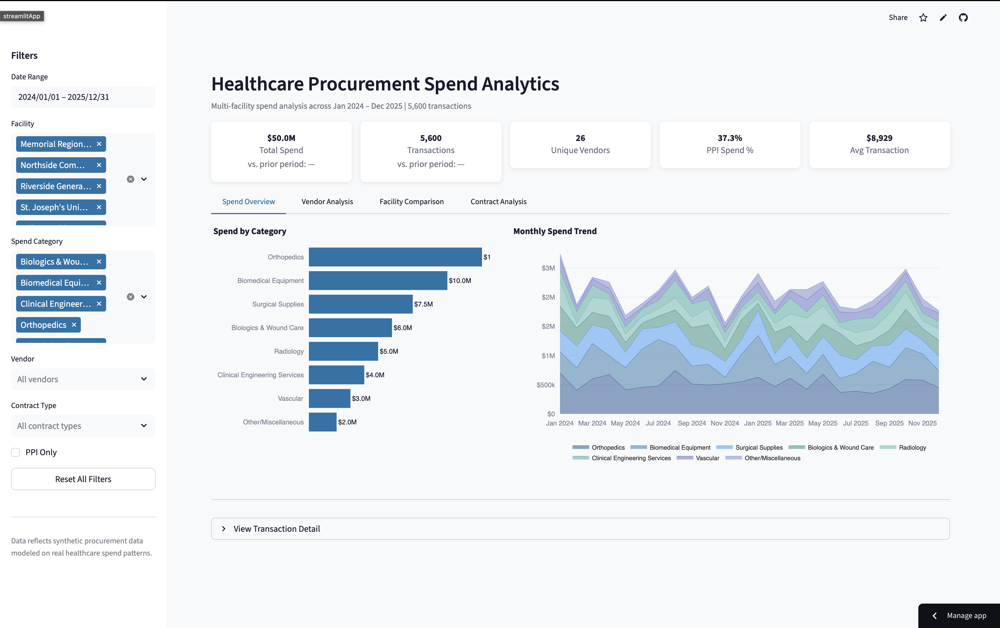
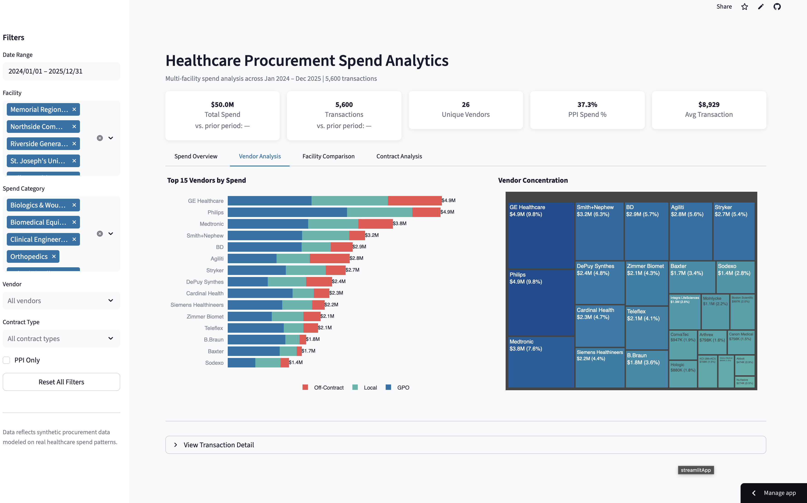
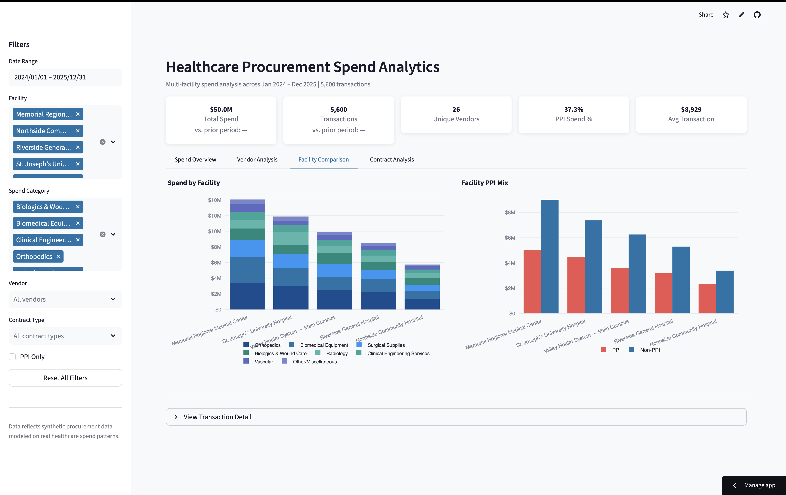
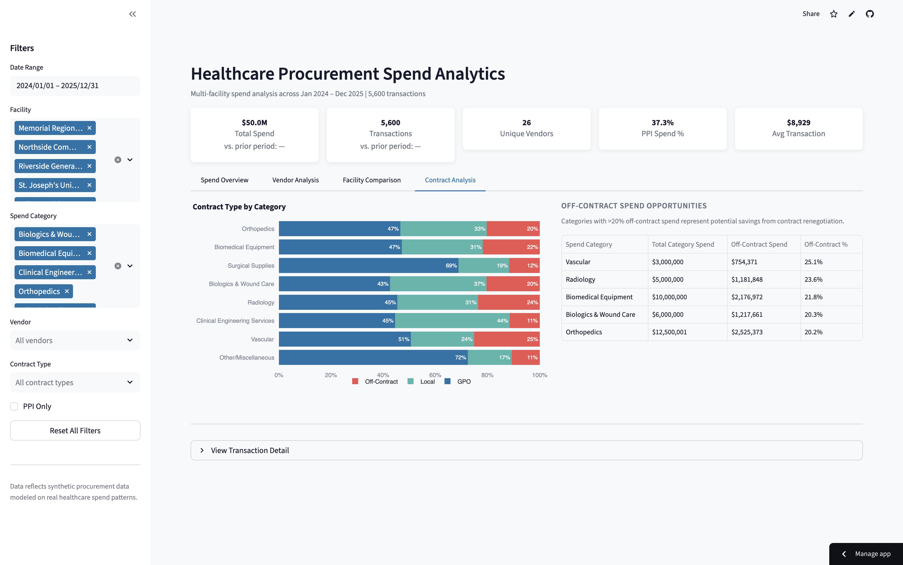

# Healthcare Procurement Spend Analytics Dashboard

An interactive Streamlit dashboard for exploring $50M in healthcare procurement spend data across a multi-hospital system.


---

## Screenshots

| Spend Overview | Vendor Analysis |
|:---:|:---:|
|  |  |

| Facility Comparison | Contract Analysis |
|:---:|:---:|
|  |  |

---

## About

Healthcare supply chain spend is one of the largest controllable costs in hospital operations, second only to labor. Across a typical multi-hospital system, supply expenses range from $30M to $500M annually — and procurement teams often lack the analytical tools to identify where money is being left on the table.

This dashboard provides procurement analysts, supply chain directors, and CFOs with an interactive view into spend patterns across facilities, vendors, and contract types. It surfaces actionable insights: which categories are over-indexed on off-contract purchasing, where vendor concentration creates risk, and how PPI (Physician Preference Item) spend — the highest-cost and hardest-to-control category — varies across facilities.

The analysis is modeled on real procurement data patterns I've encountered analyzing $296.5M in spend across 16 hospital systems. The vendor mix, category distributions, seasonal patterns, and contract type ratios reflect actual healthcare supply chain dynamics.

---

## Live Demo

[Live Demo](https://your-app-name.streamlit.app) — *Link will be updated after deployment.*

---

## Features

- **KPI Dashboard** — Total spend, transaction count, vendor count, PPI spend percentage, and average transaction value with prior-period comparisons
- **Spend Overview** — Category breakdown and monthly trend analysis with stacked area charts
- **Vendor Analysis** — Top 15 vendors by spend with contract type segmentation, plus vendor concentration treemap
- **Facility Comparison** — Per-facility spend breakdown by category and PPI vs. non-PPI mix
- **Contract Analysis** — GPO/Local/Off-Contract mix by category, with automated identification of off-contract savings opportunities
- **Interactive Filters** — Date range, facility, category, vendor, contract type, and PPI-only toggle with active filter count
- **Data Explorer** — Searchable, sortable transaction detail with CSV export

---

## Local Setup

```bash
git clone https://github.com/your-username/healthcare-spend-dashboard.git
cd healthcare-spend-dashboard
pip install -r requirements.txt
streamlit run app.py
```

The app will open at [http://localhost:8501](http://localhost:8501).

---

## Deployment

To deploy on Streamlit Community Cloud:

1. Push the repository to GitHub
2. Go to [share.streamlit.io](https://share.streamlit.io)
3. Connect your GitHub repository
4. Set the main file path to `app.py`
5. Deploy

No secrets or environment variables are required — the app uses bundled synthetic data.

---

## Tech Stack

| Component | Technology |
|---|---|
| Web Framework | Streamlit |
| Visualization | Plotly Express + Graph Objects |
| Data Processing | pandas |
| Language | Python 3.11+ |

---

## About the Data

This dashboard uses synthetic data modeled on real healthcare procurement patterns. The dataset contains 5,600 transactions totaling approximately $50M across:

- **5 hospital facilities** of varying size, from a large regional medical center to a community hospital
- **8 spend categories** — Orthopedics, Biomedical Equipment, Surgical Supplies, Biologics & Wound Care, Radiology, Clinical Engineering Services, Vascular, and Other/Miscellaneous
- **26 vendors** including major medical device and supply companies (Medtronic, Stryker, DePuy Synthes, GE Healthcare, etc.)
- **24 months** of transaction history (January 2024 – December 2025)
- **3 contract types** — GPO (Group Purchasing Organization), Local, and Off-Contract
- **Realistic product descriptions** — actual medical device and supply nomenclature

Seasonal patterns (summer surgical volume dips, Q1 budget flush), vendor concentration, facility size variation, and PPI distribution are all calibrated to reflect real-world healthcare procurement data.

---

## Author

**Paulo Nascimento** — Healthcare procurement analyst with experience analyzing $296.5M in spend across 16 hospital systems.

[LinkedIn](https://www.linkedin.com/in/paulo-nascimento)

---

## License

This project is licensed under the MIT License. See [LICENSE](LICENSE) for details.
